# ClawUI Starter Kit v2

A starter kit for building AI-powered applications with [CopilotKit](https://copilotkit.ai) and optional [OpenClaw](https://openclaw.ai) integration.

## Quickstart

```bash
# 1. Install dependencies
npm install

# 2. Set up environment
cp .env.example .env
# Edit .env with your OpenAI API key

# 3. Run
npm run dev
```

Open [http://localhost:3000](http://localhost:3000). You'll see a kanban board demo with a chat sidebar.

## Modes

ClawUI supports three modes, controlled by `CLAWPILOT_MODE` in your `.env`:

| Mode | What it does |
|------|-------------|
| `standalone` | CopilotKit + your LLM only (default) |
| `openclaw` | OpenClaw controls the app via clawg-ui |
| `hybrid` | Both agents -- `@copilot` for your LLM, `@clawpilot` for OpenClaw |

### Standalone (default)

```env
CLAWPILOT_MODE=standalone
NEXT_PUBLIC_CLAWPILOT_MODE=standalone
OPENAI_API_KEY=sk-...
```

### OpenClaw

```env
CLAWPILOT_MODE=openclaw
NEXT_PUBLIC_CLAWPILOT_MODE=openclaw
OPENCLAW_AGENT_URL=http://localhost:18789/v1/clawg-ui
OPENCLAW_AGENT_TOKEN=your-token
```

Requires the clawg-ui plugin on your OpenClaw gateway. See `clawgui/SETUP.md`.

Having auth issues (401/403) with `@clawpilot`? Follow the first-time pairing guide: [`PAIRING-CLAWG-UI.md`](./PAIRING-CLAWG-UI.md).

### Hybrid

```env
CLAWPILOT_MODE=hybrid
NEXT_PUBLIC_CLAWPILOT_MODE=hybrid
OPENAI_API_KEY=sk-...
OPENCLAW_AGENT_URL=http://localhost:18789/v1/clawg-ui
OPENCLAW_AGENT_TOKEN=your-token
```

## Use Cases

```mermaid
flowchart LR
    DEV["🧑‍💻 Developer"]
    EU["👤 End User<br/>(Browser)"]
    WAU["📱 WhatsApp<br/>User"]

    subgraph system["  ClawUI Starter Kit  "]
        direction TB

        UC1(["Setup & Configure"])
        UC2(["Register AI Tools"])
        UC3(["Expose App State"])
        UC4(["Switch Modes"])

        UC5(["Chat with @copilot"])
        UC6(["Chat with @clawpilot"])
        UC7(["@mention Agent Selection"])
        UC8(["Manage Board"])
        UC9(["View Tool Execution"])

        UC10(["Multi-Channel Commands"])
    end

    LLM["🤖 LLM Provider<br/>(OpenAI, Anthropic)"]
    OC["🔗 OpenClaw Gateway<br/>(clawg-ui)"]

    DEV --- UC1
    DEV --- UC2
    DEV --- UC3
    DEV --- UC4

    EU --- UC5
    EU --- UC6
    EU --- UC7
    EU --- UC8
    EU --- UC9

    WAU --- UC10

    UC5 --- LLM
    UC6 --- OC
    UC10 --- OC
```



### By Mode

| Use Case | Standalone | OpenClaw | Hybrid |
|----------|:----------:|:--------:|:------:|
| Chat with @copilot (local LLM) | ✅ | — | ✅ |
| Chat with @clawpilot (OpenClaw) | — | ✅ | ✅ |
| @mention agent selection | — | — | ✅ |
| AI executes registered tools | ✅ | ✅ | ✅ |
| Multi-channel access (WhatsApp) | — | ✅ | ✅ |
| Manage board (drag-and-drop) | ✅ | ✅ | ✅ |
| View tool execution status | ✅ | ✅ | ✅ |

### Actors

| Actor | Description |
|-------|-------------|
| **Developer** | Clones the kit, registers AI tools, exposes state, builds custom UI |
| **End User** | Interacts with the app via browser — chats with agents, manages the board |
| **WhatsApp User** | Sends commands and receives responses through OpenClaw's WhatsApp channel |
| **LLM Provider** | OpenAI, Anthropic, Groq — powers the @copilot agent |
| **OpenClaw Gateway** | Routes messages via clawg-ui plugin (AG-UI protocol) for @clawpilot |

---

## Project Structure

```
src/
├── app/           Next.js pages and API routes
├── core/          ClawUI framework (keep this)
│   ├── providers/ Context providers (mode, mention, attribution)
│   ├── components/
│   │   ├── chat/  Chat sidebar and input components
│   │   └── layout/ SplitLayout, WelcomePage
│   ├── hooks/     Shared hooks
│   └── lib/       Agent config, bridge config, types
├── ui/            Base UI atoms (keep this)
└── demo/          Kanban demo (delete to start fresh)
```

## Building Your Own App

1. **Delete the demo**: `rm -rf src/demo/ src/app/api/kanban/`
2. **Create your UI** anywhere in `src/`
3. **Register tools** with `useCopilotAction`
4. **Expose state** with `useCopilotReadable`
5. **Import your component** in `src/app/page.tsx`

See `docs/engineering/2_REMOVING_DEMO.md` for detailed instructions.

## Adding AI Tools

```tsx
import { useCopilotAction, useCopilotReadable } from "@copilotkit/react-core";

// Expose state to the AI
useCopilotReadable({
  description: "Current items in the shopping cart",
  value: cartItems,
});

// Register a tool the AI can call
useCopilotAction({
  name: "addToCart",
  description: "Add a product to the shopping cart",
  parameters: [
    { name: "productId", type: "string", description: "Product ID" },
    { name: "quantity", type: "number", description: "Quantity" },
  ],
  handler: async ({ productId, quantity }) => {
    addItem(productId, quantity);
    return `Added ${quantity}x ${productId} to cart`;
  },
});
```

Both agents (in hybrid mode) automatically see your tools and state.

## Documentation

- `docs/product/` -- Product profile and goals
- `docs/engineering/` -- Architecture, modes guide, demo removal
- `docs/ai/` -- Agent configuration reference
